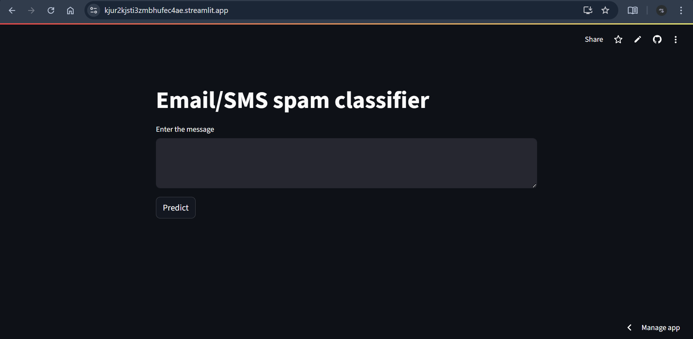

# SMS Spam Classifier

This is a Streamlit web app that classifies SMS or email messages as **spam** or **Not spam** using a machine learning model.

🔗 **Live Demo**: [Click here to try the app](https://kjur2kjsti3zmbhufec4ae.streamlit.app/)

## Features
- Clean and minimal web interface using **streamlit**
- Text preprocessing with **NLTK**:
   - Lowercasing, punctuation and special characters removal
- Bag of Words vectorization using CountVectorizer
- Classification using **Multinomial Naive Bayes** with an accuracy of 98% and a precision score of 95%
- Trained on a labelled SMS dataset

  ## Screenshot
  

## Files
- app.py: Streamlit web app

- vectorizer.pkl: Pretrained CountVector vectorizer

- model.pkl: Trained classification model

- requirements.txt: Python dependencies
- sms-spam-classifier.ipynb: Jupyter notebook containing the model
